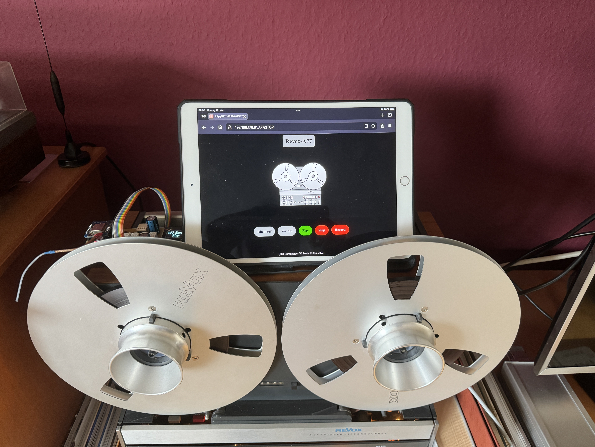

Maker Media GmbH
*** 

# Handy als Steuerung für Bandmaschine

### Auch als Retrofan kann man die Vorzüge einer Fernbedienung für die ordentlich instand gehaltene A77-Bandmaschine nicht abstreiten. Mit einem alten WLAN-fähigen Smartphone oder Tablet, einem WEMOS und ein paar Relais kann man ohne Modifikation des Tonbandgerätes eine moderne Bedienung bauen.

Den Artikel mit der Bauanleitung gibt es in der **[Make-Ausgabe 6/24](https://www.heise.de/select/make/2024/6)** zu lesen.
